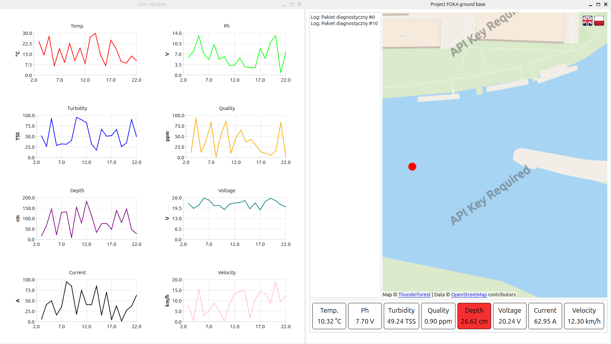

# FOKA Ground Station - Telemetry & Visualization GUI 📊

This repository contains the source code for a **Ground Control Station (GCS)** application, developed as part of a student project. The application is designed to visualize telemetry data, monitor sensor status, and track the real-time GPS position of the autonomous USV **FOKA**.


*Fig 1. Main application dashboard showing the map view and boat parameters.*


*Fig 1. Second application dashboard ploting boat parameters.*

## 🎯 Key Features

The application enables the operator to remotely supervise the floating unit through:

* **Map Visualization:** Real-time vessel tracking using a **QML** module (`mapa.qml`).
* **Telemetry Reception:** Readout of sensor data (pH, turbidity, temperature, depth) and power system parameters (voltage, current).
* **Dynamic Charts:** Real-time plotting for selected parameters (configurable via `charts_config.json`).
* **Log Management:** Ability to load and analyze historical data from log files.
* **Communication:** Serial port handling (UART/Radio Telemetry) via the `SerialManager` class.

## 🛠️ Technologies

The project was built using **C++** and the **Qt** framework.

* **Language:** C++ (backend), Python (testing scripts).
* **GUI Framework:** Qt 5/6 (Qt Widgets + Qt Quick/QML for the map).
* **Build System:** CMake.
* **Data Formats:** JSON (configuration), CSV (logs).

## 📂 Repository Structure

* **`main.cpp`, `mainwindow.cpp`**: Main application logic and main window management.
* **`chartwindow.cpp`**: Module responsible for rendering sensor data charts.
* **`serialmanager.cpp`**: Handles serial communication (receiving data frames).
* **`mapa.qml`**: Map interface file (OpenStreetMap/Mapbox integration).
* **`charts_config.json`**: Configuration file defining which charts should be displayed.
* **`sender.py`**: Python script to simulate data transmission (useful for testing the GUI without the physical boat).
* **`virtualPorts.sh`**: Shell script to create virtual serial ports (socat) for debugging purposes.

## 🚀 Build & Run

The project uses the CMake build system.

### Prerequisites
* C++ Compiler (g++ / clang)
* Qt5 or Qt6 Library (with modules: `SerialPort`, `Charts`, `Positioning`, `Location`, `Quick`)
* CMake

### Installation Guide

1.  **Clone the repository:**
    ```bash
    git clone <repository-url>
    cd <folder-name>
    ```

2.  **Build the project:**
    ```bash
    mkdir build && cd build
    cmake ..
    make
    ```

3.  **Run:**
    ```bash
    ./WDSv2  # (or the name of your generated binary)
    ```

### Testing (Simulation)
If you do not have the boat connected, you can test the application using the auxiliary scripts:
1.  Run `virtualPorts.sh` to create a virtual serial connection (loopback).
2.  Run `sender.py` to start broadcasting random telemetry data.
3.  In the application settings, connect to the appropriate virtual port.

## 🔗 Related Projects

This application is part of the FOKA project ecosystem.

* **Main Repository (Thesis & Simulation):** [thesis_USV_gazebo](https://github.com/antpial/thesis_USV_gazebo)
* **Onboard Code (Raspberry Pi):** [FokaRos2RPi4](https://github.com/antpial/FokaRos2RPi4)

---
*Author: Antoni Piałucha*
